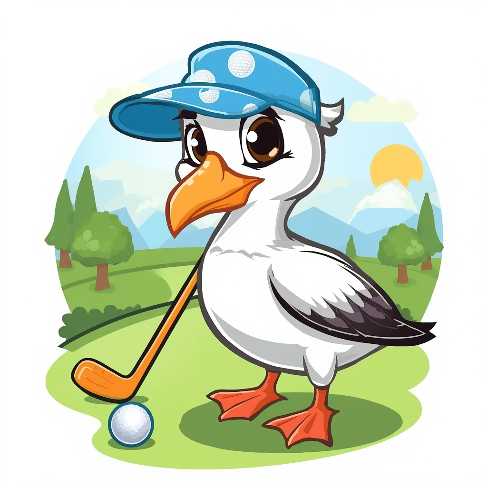

# albatross

  

Albatross is a discord bot for [putt.day](https://putt.day/) players. 

## Features

Players can share their putt.day replays with Albatross and Albatross will keep track of their scores against that map.

## Installation 

[Click here to add Albatross to your server](https://discord.com/api/oauth2/authorize?client_id=1527339297945030747&permissions=68672&scope=bot%20applications.commands)

## Usage

https://github.com/user-attachments/assets/6a87ffad-dfe0-4875-bac3-b0d23487b551

Paste a putt.day share link into any channel Albatross can see, and it reacts with ⛳ (recorded) or ⚠️ (couldn't parse it) and tracks the score against that hole.

### Slash commands

| Command | Options | Description |
| --- | --- | --- |
| `/score` | `hole` (required), `user` (required) | Show a user's score(s) on a given hole. |
| `/top` | `hole` (required), `count` (optional, default 10, max 25) | Leaderboard for a hole, lowest strokes first. |
| `/remove` | `link` (required) | Remove one of your own recorded scores by its putt.day share link. Self-service — you can only remove scores you played. |
| `/remove-any` | `link` (required) | Remove any recorded score by its share link, regardless of who played it. Restricted to server Administrators by default — see [Managing `/remove-any` access](HACKING.md#managing-remove-any-access) in HACKING.md. |

## How it works 

Albatross reads the discord channel message content looking for share links. If a share link is detected, and it has never been seen before it will:
1. Perform a `GET` request to the share link 
2. Perform a regex match over the returned HTML to extract the hole number and 
stroke/score. 
3. Add the (hole number, stroke/score, discord user) triple to it's database. 

### Caveats

* If there are any upstream changes to the format of the share link HTML then Albatross may break - at the moment this is quite fragile, perhaps there might be a more robust approach in the future. 
* In it's current form, if someone were to "steal" your share link from you and post it in a albatross-watched channel before you, they will be attributed with the share link/score. 

## Hacking

See [HACKING.md](HACKING.md) for deploying (Fly.io), adding Albatross to a server, and managing `/remove-any` access.